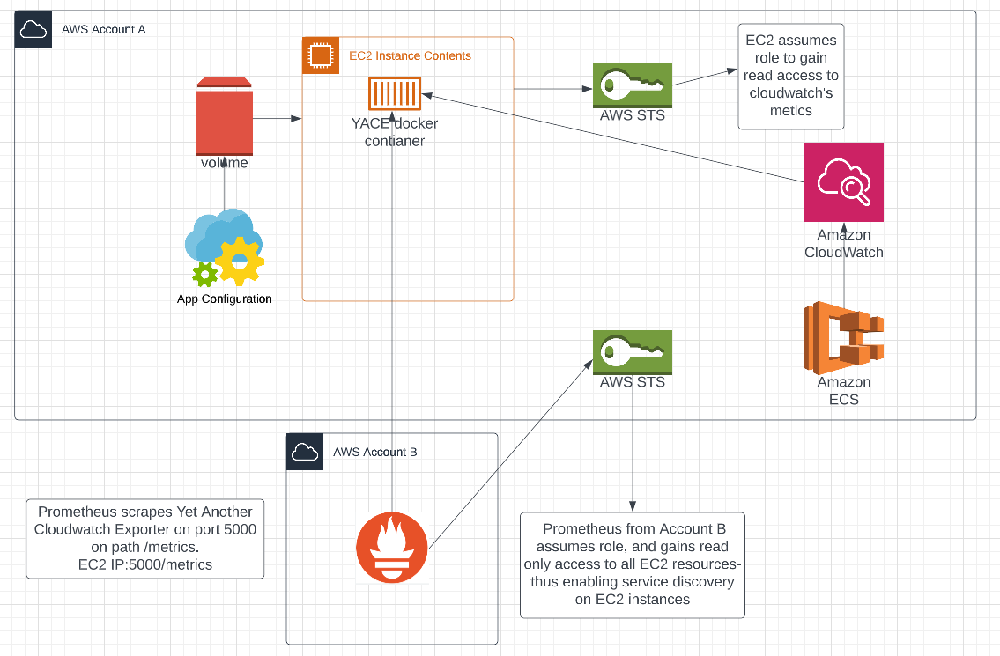

# ECS Container insight metrics collection
This project is meant to demonstrate the use of YACE to collect and export cloudwatch metrics based on the configurations set on the config file of the YACE container.

Architectural Overview

# Images used
1. YACE
2. Prometheus
3. Grafana

# Docker coomands to run containers
## code
    docker run -d --rm -v $PWD/config.yml:/tmp/config.yml -p 5000:5000 --name yace ghcr.io/nerdswords/yet-another-cloudwatch-exporter:v0.44.0-alpha
    docker run -p 9090:9090 -v ~/alert.rules.yml:/etc/prometheus/alert.rules.yml -v ~/prometheus.yml:/etc/prometheus/prometheus.yml prom/prometheus